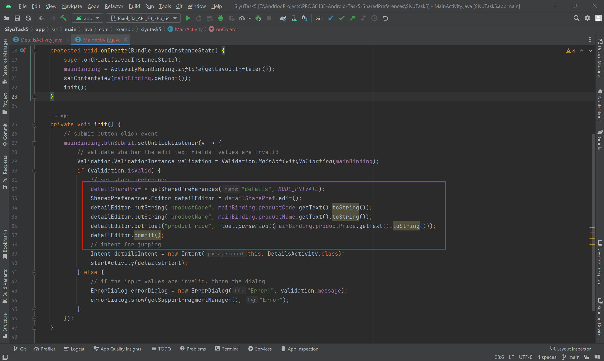

# PROG8485-Android-Task5-SharedPreferences

This application uses an activity named ‘DetailsActivity’. When entering info of three fields into the form and tap the submit button, it will jump to another activity, the data using SharedPreferences to store and retrieved by the second activity.

## Store Key-Value Pair

The usage of SharedPreferences quite like localStorage of JavaScript

## Retrieve SharedPreferences

The second param of .getString() method will be used to set a default value to get if the key for retrieving  pair may not exist.

## Preview

